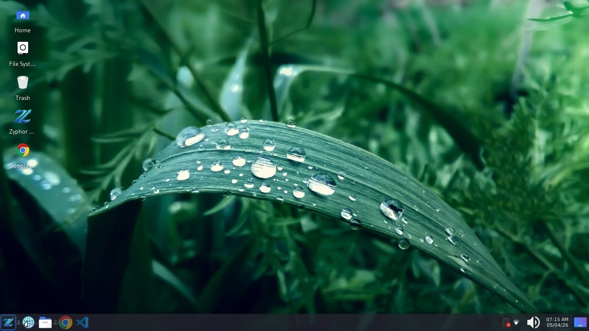
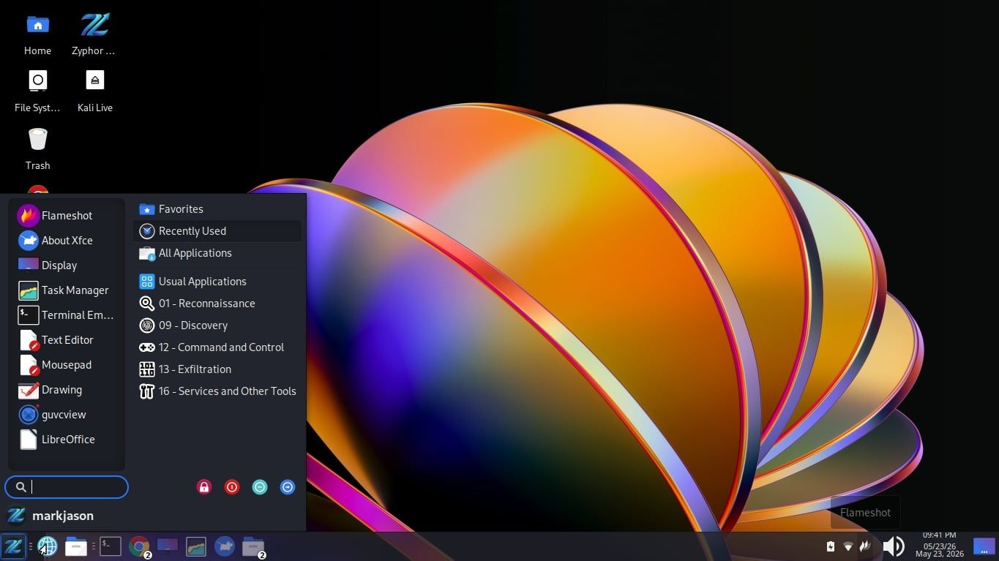
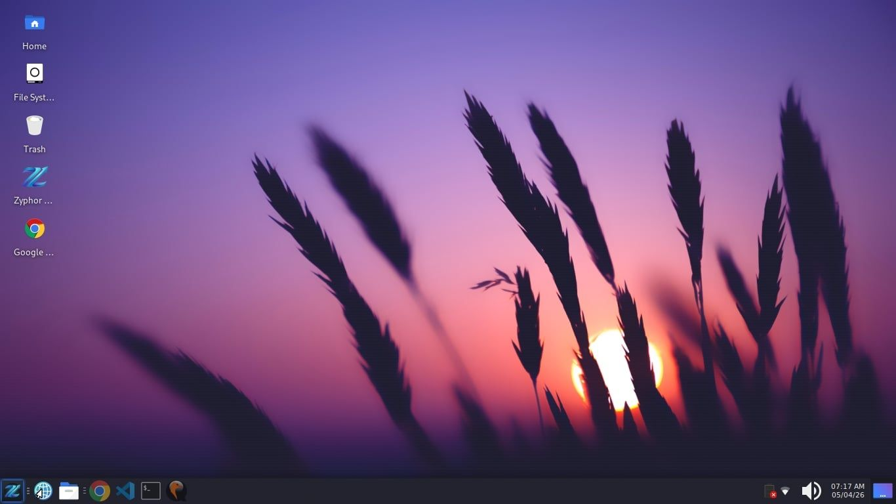

## 📚 Installer

Download the latest **Zyphor OS ISO** and get started in minutes.

👉 **[Click Here To Download Zyphor Operating System ISO (v1.11.1-2026.06.02-r3)](https://drive.google.com/uc?export=download&id=1tIEy-eED4KEGTZZNyBwuNNRFHSjzF26l)** 
> 📦 Hosted on Google Drive  
> 💿 File Type: ISO Image  

After installing, open the terminal and run this command:
```bash
zyphor help
```
---

**Creator:** Mark Jason Penote Espelita  
**Facebook Account:** https://www.facebook.com/mark.jason.penote.espelita  
**Facebook Page:** https://www.facebook.com/profile.php?id=61573426796629  
**Email:** markjasonespelita@gmail.com  
**Contact:** 09978972884 | 09203454006  
**Our Philosophy:** [ZyphorOSPhilosophy.docx](https://github.com/markjasonespelita/zyphor_os/blob/master/DOCUMENTATION/ZyphorOSPhilosophy.docx)  
**Date Created:** March 30, 2026

---
**Other projects under Zyphor OS**

Zyphor Server - https://github.com/markjasonespelita/zyphor_server

Zyphor Minimal - https://github.com/markjasonespelita/zyphor_minimal

Zyphor Packages - https://github.com/markjasonespelita/zyphor_packages

Zyphor Repo - https://github.com/markjasonespelita/zyphor_repo

---

## Contributors

Contributors are not limited to software developers. Some collaborators contributed through ideas, testing, security assessments, bug reporting, graphic design, documentation, feedback, and community support. Their efforts have helped shape and improve Zyphor OS, and their contributions are sincerely appreciated.

---

| Avatar | Name | Role |
|:---:|:---|:---|
|  | [Mark Jason Espelita](https://github.com/markjasonespelita) | Zyphor OS Creator and Lead Maintainer (Host) |
|  | [Mark Jason Espelita](https://github.com/mjespelita) | Maintainer's 2nd Account |
|  | [Mark Jason Espelita](https://github.com/mjfrontendservices) | Maintainer's 3rd Account |
|  | [Semantic Release Bot](https://github.com/semantic-release-bot) | CI/CD Automated Bot |
|  | [Dan Stephen Blanco](https://github.com/fen-lowcode) | Security Tester |
|  | [Nicole Honrado Ervas](https://github.com/NicoleHonradoErvas) | Graphic Artist |
|  | [Jenalyn Iso](https://github.com/isojenalyn14) | Graphic Artist |

---

# Introduction

**Zyphor OS** is a custom Linux distribution built on top of the powerful foundations of **Kali Linux** and **Debian**.

Designed with simplicity, performance, and control in mind, **Zyphor OS** aims to deliver a streamlined operating system experience without unnecessary bloat.

One of **Zyphor OS**’s core goals is to provide a Windows-like user experience — making it easy for users transitioning from Windows to feel right at home. From layout and navigation to workflow and usability, **Zyphor OS** minimizes the learning curve while still offering the full power of Linux underneath.

## 📸 Screenshots

<p align="center">
  
  
</p>

<p align="center">
  
  
</p>

<p align="center">
  
  
</p>

<p align="center">
  
  
</p>

<p align="center">
  
</p>

---

## Virtual Machine For Testing (QEMU System x86_64)

```bash
sudo apt update

sudo apt install qemu-system-x86 qemu-utils qemu-system-gui libvirt-daemon-system libvirt-clients bridge-utils virt-manager -y
```

# Virtualization Check Compatibility

## ✅ Step 1: Check if your CPU supports virtualization

```bash
egrep -c '(vmx|svm)' /proc/cpuinfo
```
* If result is 0 ❌ → your CPU or BIOS virtualization is OFF
* If > 0 ✅ → good, continue

## ✅ Step 2: Enable virtualization in BIOS

Reboot → enter BIOS/UEFI → enable:

* Intel: VT-x
* AMD: SVM

Save and boot back.

## ✅ Step 3: Install KVM packages

```bash
sudo apt update

sudo apt install qemu-kvm libvirt-daemon-system libvirt-clients bridge-utils -y
```

## ✅ Step 4: Load KVM modules

For Intel:

```bash
sudo modprobe kvm-intel
```

For AMD:

```bash
sudo modprobe kvm-amd
```

Then check:

```bash
lsmod | grep kvm
```
You should see **kvm_intel** or **kvm_amd**

## ✅ Step 5: Test the ISO (Live Mode)

```bash
sudo qemu-system-x86_64 --enable-kvm --cdrom <iso-name>.iso -m 2048
```
---
## Create a persistent QEMU virtual disk

```bash
sudo qemu-img create -f qcow2 zyphor_test.qcow2 25G
```
## Load the ISO file inside the virtual disk

```bash
sudo qemu-system-x86_64 --enable-kvm --cdrom <iso-name>.iso --hda zyphor_test.qcow2 --boot d -m 2048
```

## Boot virtual disk

```bash
sudo qemu-system-x86_64 --hda zyphor_test.qcow2 --boot c -m 2048
```

## Delete virtual disk anytime

```bash
sudo rm -rf zyphor_test.qcow2 --verbose
```

---

## 📚 References

- 🌐 [Debian Official Website](https://www.debian.org)
- 🐉 [Kali Linux Official Website](https://www.kali.org)
- 🧠 [The Linux Kernel (GitHub)](https://github.com/torvalds/linux)

---

## 📄 Attribution & Licensing

**Zyphor OS** is a custom Linux distribution built on top of  
**Debian** and **Kali Linux**.

We gratefully acknowledge the work of the developers and communities behind these projects.

- **Debian** provides the core system and package ecosystem.  
- **Kali Linux**, developed by **Offensive Security**, provides security tools and system enhancements.

---

## 📜 License

**Zyphor OS**-specific configurations, scripts, and customizations are licensed under the GNU General Public License (GPL).

You are free to use, modify, and distribute these components under the terms of the GPL, provided that any distributed modified versions are also released under the same license.

This ensures that improvements to Zyphor OS remain open source and benefit the community.

---

## ⚖️ Third-Party Software

**Zyphor OS** includes software packages distributed under various open-source licenses, including but not limited to:

- **GNU General Public License (GPL)** 
- **MIT License**
- **Apache License**

All original licenses remain in effect and are fully respected.

License details for individual packages can be found in:

```bash
/usr/share/doc/*/copyright
```
---

## ⚠️ Disclaimer

**Zyphor OS** is an independent project and is not affiliated with, endorsed by, or sponsored by:

**Debian** 
**Kali Linux** 
**Offensive Security** 

All trademarks and registered trademarks are the property of their respective owners.

---

## 🛡️ Branding

The name **"Zyphor OS"** and its logo are the property of the creator.

Redistribution of modified versions using the **Zyphor OS** name or branding
is not permitted without explicit permission.

---

## 🤝 Contributions

This project is open for contributions.

You are free to fork the project, make changes, and submit pull requests.

**🌐 For Web Developers (Documentation Contributors)**

If you are contributing to the documentation:

- Focus only on files inside the `/docs` directory
- Improve clarity, structure, and readability of existing content
- Add new guides, tutorials, or explanations when needed
- Ensure all commands and instructions are tested and accurate
- Follow consistent formatting (Markdown structure, headings, code blocks)

⚠️ Please avoid modifying system files, build scripts, or configurations unless explicitly requested.

**🛠️ For Distribution Developers (System Contributors)**

If you are working on the system itself:

- You are free to modify configurations, packages, and system behavior
- You may improve build scripts, performance, and overall system design
- You can propose new features, optimizations, or enhancements
- Ensure your changes are stable, tested, and do not break core functionality

**📌 General Guidelines**

- Keep commits clean and descriptive
- Follow the existing project structure
- Test your changes before submitting
- Be respectful and constructive in discussions

**🚀 Pull Request Process**

- Fork the repository
Create a new branch for your changes
- Make your modifications
- Submit a pull request with a clear description

All contributions will be reviewed before merging.

---

## 🚧 Project Status

This project is still under active development.  
Contributions, suggestions, and improvements are welcome! 😊

---

## 🏷️ #hobby_project
## 🏷️ #open_source
